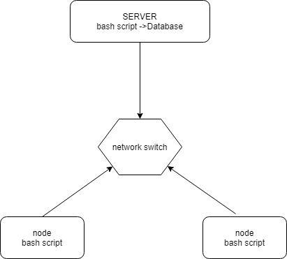

## Introduction
The Jarvis Linux Cluster Administration (LCA) team manages a Linux cluster of 10 nodes/servers which are running CentOS 7. The idea is to monitor the system usage of these nodes and server that helps the LCA team to meet their business needs. I need to implement the program using bash scripts and the PostgreSQL database to monitor the system hardware information and CPU resource, and also write SQL queries to answer some business need. this project helps the infrastructure team to get the idea of the CPU usage and improve the system performance. 

## Architecture and Design
### The diagram of the project  
   
 as shown in the diagram, the two clients connect toe the server via internet and each client has it's own bash scripts and collects their hardware information and cpu usage information, and then insert into the database in server which is in the postgresql instance.
### Describe tables:  
the database contains two tables in postgresql instance. `host_info` and `host_usage`, `host_info` contains the hardware information of the system and `host_usage` contains the real time information of hte cpu usage and the memory usage

**host_info.sh:** the `host_info.sh` table collecs the hardware infomation of the system and identify each node name.

- `id`: primary key for the `hsot_info` table, is to identify each host client.
- `hostname`: the name of the each host system,
- `cpu_number`: the core number of the cpu.
- `cpu_architecture`: the architecture of the cpu.
- `cpu_model`: the factory model name of the cpu.
- `cpu_mhz`: the speed of the core.
- `L2_cache`: the total amount of storage of the level2 cache.
- `total_mem`: the total memory of the system.  

**host_usage.sh:** the `host_usage.sh` table collect the real time measurement of hte cpu usage and the memory of the system.

- `timestamp`: identifiy the collection time of each data.
- `host_id`: the node's id.
- `memory_free`: the total amount of free memory in the system in real time.
- `cpu_idle`: the amount of cpu spent in idle state.
- `cpu_kernel`: the percentage of time cpu spend in running kernel/system.
- `disk_io`: Number of current disk I/O operation in progress.
- `disk_available`: the total amount of free storage in system. 

### Describe scripts 

- `host_info.sh`: this script is for collecting the hardware infomation of the system.
- `host_usage.sh`: this script is to collect real time cpu and memory usage in the system.
- `psal_docker.sh`: is used to star/stop and create the postgresql container instance in docker.
- `ddl.sql`: this script is for generate two table in database, `host_info` and `host_usage`.
- `queries`: this script is to collect the information about the hardware and the average usage of the memory in 5 minutes interval for each system.   

## Usage
1)initializing the database and tables
> by using the `docker_psql.sh` script, the postgresql instance is create and start, after running the script `ddl.sql` file, there are two table being generate, `host_info` and `host_usage`.  
`./linux_sql/scripts/psql_docker.sh start db_password`
2) `host_info.sh` usage
> by using the `host_info.sh` script, the hardware information of the system is collected and inserted into the table `host_info`.  
`./linux_sql/scripts/host_info.sql psql_host psql_port db_name psql_user psql_password`
3) `host_usage.sh` usage
> by using the `host_usage.sh` script, the real time memory usage and the cpu information is collected and inserted into the `host_usage`table.  
`./linux_sql/scripts/host_usage.sql psql_host psql_port db_name psql_user psql_password`
4) crontab setup
> the crontab is used to automaticly run the script, in this case, the `host_usage` script is able to run in every minute period.the command to create crontab is `crontab -l`. with the listed crontab job below.
`* * * * * bash [path]/host_usage.sh psql_host psql_port db_name psql_user psql_password > /tmp/host_usage.log`  
## Improvements 
1) handle hardware update, will able to modify the new hardware information in the table.
2) have abilaity to handle the outbound information and generate error message,. and for the average cpu usage, the table will ignore the wroong data and make the table more accurate.
3) have ability to send out alert for unnormal cpu usage in the system and terminate the abnormal process in background with message to the user with the name of the process and it's directory.
